# Fraud Detection Flow

```mermaid
flowchart TD
    START([Transaction Authorized]) --> WEBHOOK{Razorpay Webhook<br/>payment.authorized}
    
    WEBHOOK --> EXTRACT[Extract Transaction Data<br/>• Card BIN<br/>• Amount<br/>• Customer ID<br/>• IP/Geolocation<br/>• Device Fingerprint]
    
    EXTRACT --> RULES_START[Rules Layer Start]
    
    subgraph "Rules Scoring (40% weight)"
        RULES_START --> R1{Velocity Check<br/>5+ txns in 10 min?}
        R1 -->|Yes +25| R2
        R1 -->|No| R2{Geolocation<br/>Mismatch?}
        R2 -->|Yes +20| R3
        R2 -->|No| R3{Device<br/>Unknown?}
        R3 -->|Yes +15| R4
        R3 -->|No| R4{Compromised<br/>BIN?}
        R4 -->|Yes +25| R5
        R4 -->|No| R5{Time<br/>Anomaly?}
        R5 -->|Yes +10| R6
        R5 -->|No| R6{High-Risk<br/>Category?}
        R6 -->|Yes +10| RULES_SCORE
        R6 -->|No| RULES_SCORE[Rules Score: 0-100]
    end
    
    RULES_SCORE --> ML_START[ML Model Inference]
    
    subgraph "ML Scoring (60% weight)"
        ML_START --> FEATURES[Extract 25 Features<br/>• Transaction metadata<br/>• Customer history<br/>• Device behavior<br/>• Temporal patterns]
        FEATURES --> CACHE{Check Redis<br/>Cache}
        CACHE -->|Hit| ML_SCORE
        CACHE -->|Miss| XGBOOST[XGBoost Model<br/>Fraud Probability]
        XGBOOST --> CACHE_STORE[Store in Redis<br/>TTL: 1 hour]
        CACHE_STORE --> ML_SCORE[ML Probability: 0-1]
    end
    
    ML_SCORE --> HYBRID[Hybrid Score<br/>40% Rules + 60% ML<br/>Final: 0-100]
    
    HYBRID --> CONFIDENCE{Confidence<br/>Analysis}
    
    CONFIDENCE -->|>0.85 High| HIGH[High Confidence<br/>Fraud Score > 85]
    CONFIDENCE -->|0.70-0.85 Med| MEDIUM[Medium Confidence<br/>Fraud Score 70-85]
    CONFIDENCE -->|0.50-0.70 Low| LOW[Low Confidence<br/>Fraud Score 50-70]
    CONFIDENCE -->|<0.50| ALLOW[Low Risk<br/>Score < 50]
    
    HIGH --> CONFIG1{Merchant Config<br/>fraud_action_mode}
    CONFIG1 -->|BLOCK| BLOCK[🚫 AUTO-BLOCK<br/>Transaction Declined]
    CONFIG1 -->|HOLD| HOLD[⏸️ HOLD<br/>Pending Review]
    CONFIG1 -->|FLAG| FLAG[🚩 FLAG<br/>Merchant Review<br/>5 min timeout]
    CONFIG1 -->|ALERT| ALERT[⚠️ ALERT<br/>Proceed + Notify]
    
    MEDIUM --> FLAG
    LOW --> ALERT
    ALLOW --> PROCEED[✅ ALLOW<br/>Transaction Proceeds]
    
    BLOCK --> LOG[Log to PostgreSQL<br/>+ Update Dashboard]
    HOLD --> LOG
    FLAG --> LOG
    ALERT --> LOG
    PROCEED --> LOG
    
    LOG --> WEBSOCKET[WebSocket Push<br/>Real-time Dashboard Update]
    WEBSOCKET --> END([End])
    
    %% Styling
    classDef start fill:#e8f5e9,stroke:#2e7d32,stroke-width:3px
    classDef rules fill:#fff3e0,stroke:#e65100,stroke-width:2px
    classDef ml fill:#f3e5f5,stroke:#6a1b9a,stroke-width:2px
    classDef decision fill:#e1f5fe,stroke:#0277bd,stroke-width:2px
    classDef action fill:#ffebee,stroke:#c62828,stroke-width:2px
    classDef success fill:#c8e6c9,stroke:#388e3c,stroke-width:2px
    
    class START,END start
    class R1,R2,R3,R4,R5,R6,RULES_SCORE rules
    class ML_START,FEATURES,CACHE,XGBOOST,ML_SCORE ml
    class HYBRID,CONFIDENCE,HIGH,MEDIUM,LOW,ALLOW decision
    class BLOCK,HOLD,FLAG,ALERT action
    class PROCEED,LOG,WEBSOCKET success
```

## Decision Thresholds

### High Confidence (Score > 85, Confidence > 0.85)
- **0.01% False Positive Rate**
- **Action**: AUTO-BLOCK (if merchant enables)
- **Example**: Velocity attack detected (8 transactions in 5 minutes from same card, different IPs)

### Medium Confidence (Score 70-85, Confidence 0.70-0.85)
- **1-2% False Positive Rate**
- **Action**: FLAG for manual review
- **Example**: High-value first purchase from new customer, geolocation slightly off

### Low Confidence (Score 50-70, Confidence 0.50-0.70)
- **No transaction impact**
- **Action**: ALERT only (merchant sees in dashboard)
- **Example**: Unusual purchase time, but customer has good history

### Low Risk (Score < 50)
- **Action**: ALLOW (no alert)
- **Example**: Repeat customer, consistent behavior, low-risk category

## Explainability

Every decision includes human-readable explanation:
- **Rules triggered**: "Velocity check (+25), Geolocation mismatch (+20)"
- **ML factors**: "High-risk based on device fingerprint and transaction amount"
- **Confidence**: "85% confident this is fraud"
- **Recommendation**: "Suggested action: FLAG for review"

Merchants see this in the dashboard and can override decisions.
