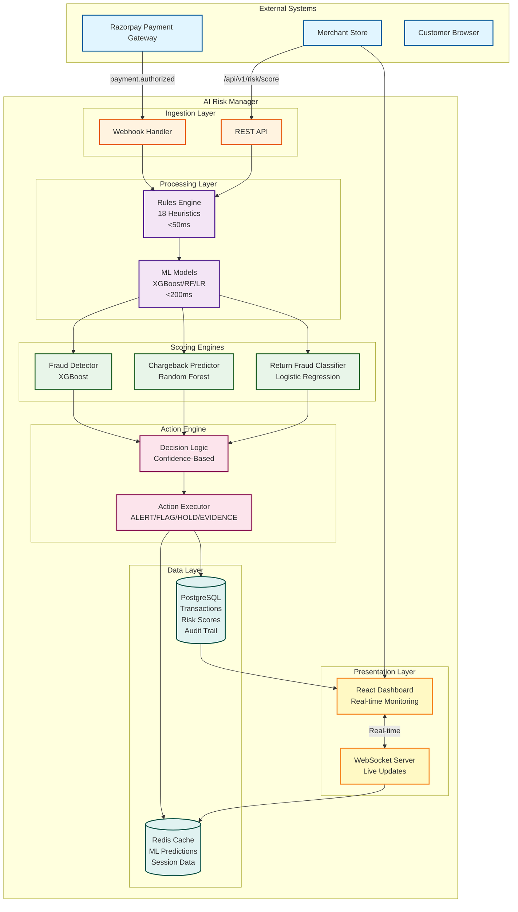

# System Architecture

## Key Components

### 1. Ingestion Layer
- **Webhook Handler**: Processes Razorpay payment events in real-time
- **REST API**: Synchronous risk scoring endpoint for checkout integration

### 2. Processing Layer
- **Rules Engine**: 18 deterministic heuristics (<50ms latency)
  - Fraud rules: velocity, geolocation, device fingerprint, BIN risk, time anomaly
  - Chargeback rules: high-value first txn, quick returns, tracking behavior
  - Return fraud rules: wardrobing, serial returner patterns
- **ML Models**: Probabilistic scoring (<200ms latency)
  - Cached predictions in Redis for sub-10ms lookups

### 3. Scoring Engines (Modular)
- **Fraud Detector**: XGBoost (70% recall @ 0.5% FPR)
- **Chargeback Predictor**: Random Forest (60% chargeback prevention)
- **Return Fraud Classifier**: Logistic Regression (80% recall on patterns)

### 4. Action Engine
- **Decision Logic**: Confidence-based bucketing (high/medium/low)
- **Action Executor**: ALERT → FLAG → HOLD → AUTO-EVIDENCE modes

### 5. Data Layer
- **PostgreSQL**: Persistent storage for transactions, scores, audit trail
- **Redis**: ML model cache, session management, real-time queues

### 6. Presentation Layer
- **React Dashboard**: Merchant-facing UI with real-time transaction feeds
- **WebSocket**: Live updates for instant risk score visibility

## Latency Targets

| Component | Target | Why |
|-----------|--------|-----|
| Rules Engine | <50ms | Synchronous checkout integration |
| ML Inference | <200ms | Acceptable for risk scoring |
| End-to-End API | <250ms p99 | Doesn't slow down payment flow |
| Dashboard Updates | <1s | Real-time merchant visibility |

## Scale Targets

- **Throughput**: 500 TPS (matches Razorpay scale)
- **Daily Volume**: 35M transactions
- **False-Positive Rate**: <0.5% (17,500 incorrect flags/day max)
- **Availability**: 99.9% uptime target
